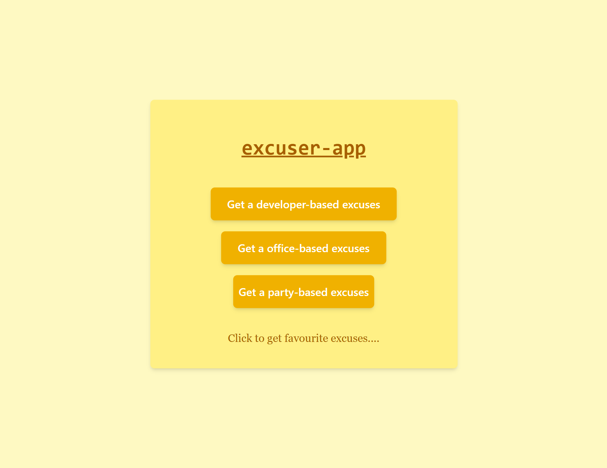
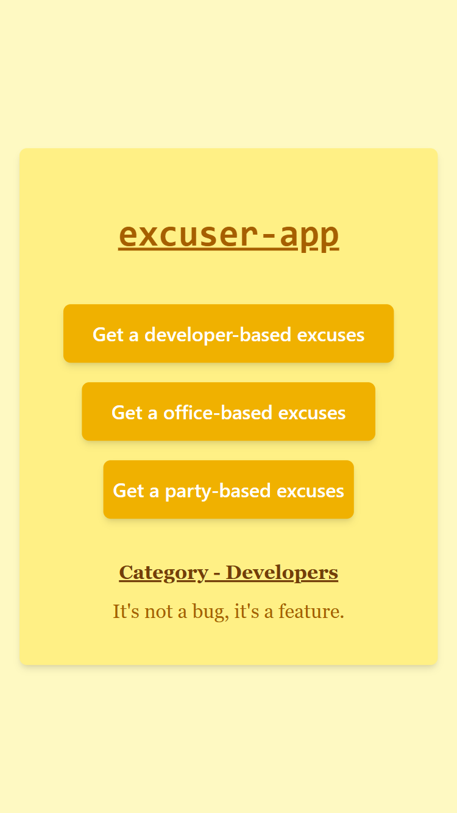

# Excuse App

The **Excuse App** is a simple React application that fetches random excuses from a public API and displays them to the user. It uses React's `useState` hook to manage state and `fetch()` for API requests. The UI is styled using Tailwind CSS for a clean and responsive design.

## 🚀 Features

- Fetches a random excuse from a public excuse API
- Categories like developer, office, party, and more can add.(based on API support)
- Responsive UI built with Tailwind CSS
- Lightweight and beginner-friendly

## 🛠️ Tech Stack

- **React** (with Hooks)
- **Tailwind CSS**
- **Excuser API** ([Excuser](https://excuser-three.vercel.app/))
- **JavaScript (ES6+)**

## Screenshots

- Large Screen
  
- Small Screen
  

## Demo Link

[live Demo]()
